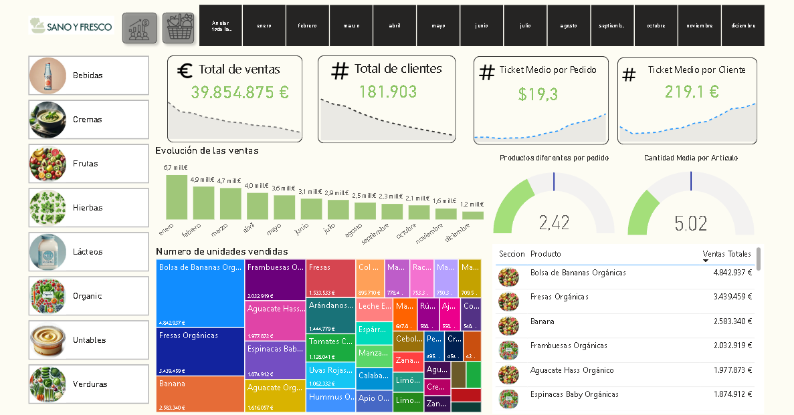
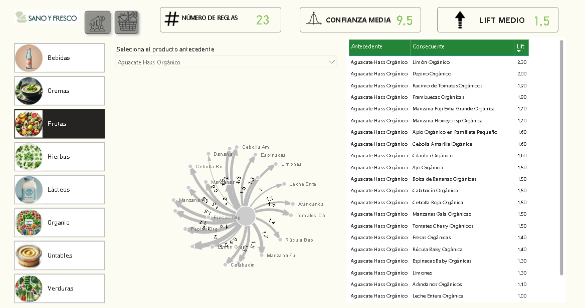

# 🛒 Market Basket Analysis & Sales Analytics

Análisis de más de **4 millones de transacciones** para descubrir patrones de compra mediante **Machine Learning** y construir un dashboard interactivo en **Power BI** para facilitar la toma de decisiones comerciales.

## 📌 Objetivo

Este proyecto tiene como finalidad identificar qué productos son comprados con mayor frecuencia en un mismo ticket utilizando técnicas de **Market Basket Analysis (MBA)**. Los resultados permiten detectar oportunidades de **venta cruzada (Cross-Selling)**, optimizar promociones y comprender mejor el comportamiento de los clientes.

---

## 🚀 Tecnologías utilizadas

- SQL
- Python
  - Pandas
  - itertools
- Power BI

---

## 📊 Dataset

- Más de **4 millones de registros** de ventas.
- Limpieza y validación de datos antes del análisis.
- Procesamiento optimizado para trabajar con grandes volúmenes de información.

---

## ⚙️ Proceso del proyecto

### 1. Analisis de los datos (SQL)

Se realizó la validación de la base de datos utilizando:

- Subconsultas
- Validación de datos nulos y duplicados
- Normalización de información

El objetivo fue garantizar el entendimiento de los datos antes del análisis.

---

### 2. Market Basket Analysis (Python)

Se implementó el algoritmo para descubrir reglas de asociación entre productos.

Durante el proceso se calcularon métricas como:

- Soporte (Support)
- Confianza (Confidence)
- Lift

Estas métricas permitieron identificar únicamente las asociaciones con mayor relevancia comercial.

---

### 3. Optimización del rendimiento

Debido al tamaño del dataset, se implementaron estrategias para evitar el consumo excesivo de memoria.

Se utilizaron:

- `itertools`
- Procesamiento por combinaciones
- Filtrado temprano de reglas
- Optimización de estructuras de datos con Pandas

Esto permitió procesar millones de combinaciones sin provocar desbordamientos de memoria.

---

### 4. Dashboard y limpieza en Power BI

Se realizo la limpieza y preparación de los datos en Power Query.
Finalmente se desarrolló un dashboard interactivo con:

- Segmentación dinámica
- KPIs de ventas
- Productos más vendidos
- Reglas de asociación
- Indicadores de Cross Selling
- Visualizaciones para facilitar la toma de decisiones

---

## 📈 Resultados

✔ Procesamiento de más de **4 millones de registros**

✔ Identificación de patrones de compra entre productos

✔ Descubrimiento de oportunidades de venta cruzada

✔ Dashboard interactivo para análisis comercial

✔ Pipeline completo desde SQL → Python → Power BI

---

## 💡 Lo que aprendí

Este proyecto me permitió aprender a trabajar con grandes volúmenes de datos y optimizar procesos de análisis para evitar problemas de memoria.

Entre los principales aprendizajes destacan:

- Optimización de procesamiento utilizando `itertools`.
- Aplicación práctica del algoritmo
- Interpretación de las métricas **Support, Confidence y Lift**.
- Integración de SQL, Python y Power BI dentro de un flujo de análisis de datos.
- Desarrollo de dashboards orientados a la toma de decisiones.
---

## 📷 Dashboard

## 👨‍💻 Autor

**Christofer Ynga**

Proyecto desarrollado como práctica de análisis de datos utilizando SQL, Python y Power BI.
